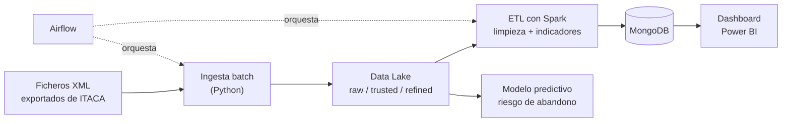

# Proyecto 1 · Analítica académica ITACA (origen XML)

## Descripción y objetivo

Construir un **dashboard de análisis académico en Power BI** a partir de datos reales de la plataforma **ITACA** de la Conselleria de Educación, exportados como ficheros **XML**. El pipeline ingesta, limpia y modela las calificaciones del alumnado para calcular indicadores académicos y, en la fase final, un **modelo predictivo de rendimiento / riesgo de abandono**.

- **Tipo de arquitectura:** batch
- **Almacenamiento:** Data Lake (raw / trusted / refined) + MongoDB
- **Procesamiento:** Apache Spark (batch)
- **Visualización:** Power BI
- **IA aplicada:** predicción de abandono

## Arquitectura

> Diagrama provisional (Bloque 0). Se actualizará al terminar cada bloque.

